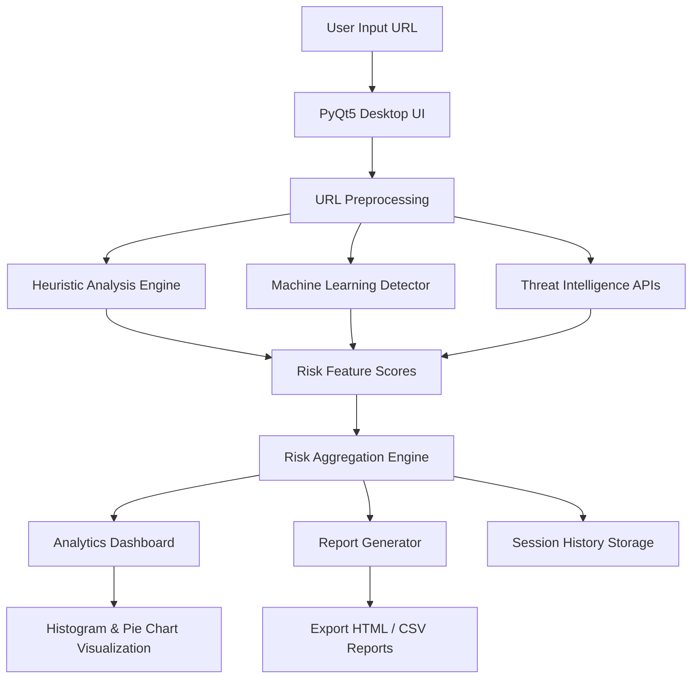

# System Architecture

PhishGuard Pro follows a **modular layered architecture** where each component is responsible for a specific stage of URL analysis and reporting.

The system integrates **Machine Learning, heuristic security checks, and external threat intelligence services** to provide reliable phishing detection.

---

## Architecture Overview

---

# Component Description

## 1. User Interface Layer

**Technology:** PyQt5

Responsibilities:

- Accept URL input from user
- Display scan progress and results
- Show analytics dashboard
- Provide report export options

Main components:

- Dashboard UI
- Scan result cards
- Progress indicators
- Visualization panels

---

## 2. URL Preprocessing Layer

This stage prepares the URL before analysis.

Tasks include:

- URL normalization
- Domain extraction using **tldextract**
- Tokenization for ML feature extraction
- Validation of URL format

---

## 3. Heuristic Analysis Engine

This module performs **rule-based phishing detection** by analyzing structural properties of URLs.

Checks include:

- IP address detection in URLs
- Presence of `@` symbol
- URL length analysis
- Suspicious tokens
- Multiple subdomains
- Unsafe TLDs
- HTTPS presence
- SSL certificate validity
- Domain age verification via WHOIS

The output is a **heuristic risk score**.

---

## 4. Machine Learning Detection Layer

The ML module predicts phishing probability using a trained classifier.

Workflow:

1. URL converted to **character-level TF-IDF vectors**
2. Vector passed to **Logistic Regression model**
3. Model outputs **phishing probability score**

Advantages:

- Fast predictions
- Lightweight model
- Suitable for real-time detection

---

## 5. Threat Intelligence Layer

This layer queries external security services to validate URLs.

Integrated APIs:

- **VirusTotal API**  
  Provides reputation score based on multiple antivirus engines.

- **Google Safe Browsing API**  
  Detects known malicious and phishing domains.

These results enhance detection accuracy.

---

## 6. Risk Aggregation Engine

All detection results are combined to produce a **final phishing risk score**.

Inputs:

- Heuristic analysis score
- Machine learning probability
- Threat intelligence verdict

The system then classifies URLs into categories such as:

- Safe
- Suspicious
- High Risk
- Confirmed Phishing

---

## 7. Analytics and Reporting

The analytics module generates visual insights and reports.

Features:

- Histogram of phishing risk scores
- Pie chart showing safe vs phishing URLs
- Mean risk score indicator
- Scan history tracking

Reports can be exported as:

- **HTML reports**
- **CSV session logs**

---

# Architecture Benefits

The layered architecture provides several advantages:

- **Modularity** – each detection layer can be improved independently
- **Scalability** – new security modules can be added easily
- **Accuracy** – combining ML + heuristics + threat intelligence improves detection reliability
- **Performance** – lightweight ML model enables real-time analysis
- **Maintainability** – clean separation between UI, analysis, and reporting layers
